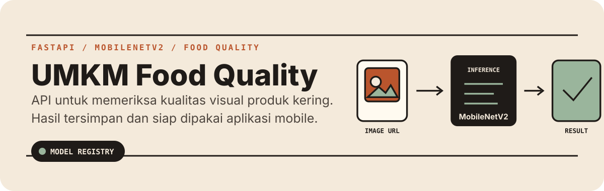
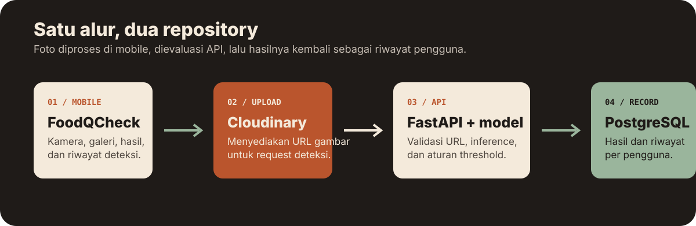

# UMKM Food Quality API

<p align="center">
  
</p>

Backend untuk **FoodQCheck**, aplikasi pemeriksaan kualitas visual produk makanan kering UMKM. API menerima URL foto, menjalankan inferensi MobileNetV2, lalu menyimpan hasil keputusan, tingkat keyakinan, dan riwayat per pengguna.

> Model ini adalah alat bantu pemeriksaan visual, bukan pengganti pemeriksaan keamanan pangan atau keputusan mutu akhir.

## Sistem

<p align="center">
  
</p>

Repository ini adalah layanan backend. Client Android/web berada di repository terkait: [`umkm-food-quality-mobile`](https://github.com/Drenzzz/umkm-food-quality-mobile).

## Kemampuan

- Autentikasi JWT untuk register, login, profil, penggantian password, dan penghapusan akun.
- Deteksi dari `image_url` dengan label `Layak Jual` atau `Tidak Layak Jual`.
- Riwayat deteksi per pengguna dengan pagination dan penghapusan data.
- Dashboard admin untuk ringkasan, daftar deteksi, registry model, dan perbandingan model opsional.
- Grad-CAM tersedia untuk tampilan admin agar area fokus model dapat ditinjau.
- Perlindungan runtime: rate limit, validasi host, CORS terbatas, SSRF guard pada URL gambar, dan container non-root.

## Stack

| Area | Teknologi |
| --- | --- |
| API | FastAPI, Uvicorn, Pydantic |
| Machine learning | TensorFlow, MobileNetV2, NumPy, Pillow |
| Data | SQLAlchemy, Alembic, PostgreSQL atau SQLite untuk development |
| Security | python-jose, Passlib/bcrypt, SlowAPI |
| Deployment | Docker Compose, Gunicorn, Caddy |

## Mulai Cepat

### Prasyarat

- Python `3.11`
- Artefak model aktif di lokasi yang ditentukan oleh `.env`
- PostgreSQL untuk environment production; development dapat memakai SQLite sesuai konfigurasi

### Jalankan backend

```bash
cp .env.example .env
python3.11 -m venv .venv
source .venv/bin/activate
python -m pip install -r requirements-backend.txt
python -m pip install -r requirements-dev.txt
uvicorn app.main:app --reload --host 0.0.0.0 --port 8000
```

Periksa layanan:

```bash
curl http://localhost:8000/health
```

Dokumentasi OpenAPI tersedia di `http://localhost:8000/docs` saat `APP_ENV` bukan `production`.

### Environment machine learning

Pisahkan dependency training dari runtime API:

```bash
python3.11 -m venv .venv-ml
source .venv-ml/bin/activate
python -m pip install -r requirements-ml.txt
./scripts/run_ml_python.sh -c "import tensorflow as tf; print(tf.config.list_physical_devices('GPU'))"
```

## Konfigurasi

Salin `.env.example` sebelum menjalankan aplikasi. Variabel yang paling penting:

| Variabel | Fungsi |
| --- | --- |
| `APP_ENV` | Mode `development`, `test`, atau `production` |
| `DATABASE_URL` | Koneksi database |
| `SECRET_KEY` | Secret untuk penandatanganan JWT |
| `MODEL_PATH` | File model aktif `.keras` |
| `CLASS_INDICES_PATH` | Mapping label model aktif |
| `ACTIVE_MODEL_CONFIG_PATH` | Manifest penentu model aktif dan threshold |
| `CORS_ORIGINS` | Origin client yang diizinkan |
| `ALLOWED_IMAGE_DOMAINS` | Host gambar yang boleh diproses endpoint deteksi |

Buat secret baru dengan:

```bash
python -c "import secrets; print(secrets.token_urlsafe(48))"
```

Lihat [referensi environment](./docs/environment_variables.md) untuk daftar lengkap dan aturan secret.

## Kontrak API

| Grup | Endpoint utama | Akses |
| --- | --- | --- |
| Health | `GET /health` | Publik |
| Auth | `POST /auth/register`, `POST /auth/login`, `GET/PATCH /auth/me` | Publik / Bearer |
| Deteksi | `POST /detect` | Bearer |
| Riwayat | `GET /history`, `GET /history/latest`, `GET /history/{id}` | Bearer |
| Admin | `GET /admin/dashboard`, `GET /admin/models`, `GET /admin/detections` | Admin |

Contoh request deteksi:

```json
{
  "image_url": "https://res.cloudinary.com/example/image/upload/product.jpg"
}
```

Respons mengandung label, confidence score, threshold yang dipakai, versi model, penjelasan singkat, URL gambar, dan waktu pembuatan. Detail lengkap tersedia di [API contract](./docs/api_contract.md) dan [inference contract](./docs/inference_contract.md).

## Model dan Data

Model aktif saat ini adalah `umkm_food_quality_v1`, sebuah baseline MobileNetV2. Threshold dibaca dari manifest model aktif, bukan di-hardcode di API.

- Alur dataset: [dataset flow](./docs/dataset_flow.md)
- Mapping dan metadata: [dataset mapping](./docs/dataset_mapping.md) dan [metadata schema](./docs/metadata_schema.md)
- Evaluasi serta quality gate: [model evaluation notes](./docs/model_evaluation_notes.md)
- Kebijakan threshold: [threshold policy](./docs/threshold_policy.md)

## Struktur Repository

```text
umkm-food-quality/
├── app/        # FastAPI, database, auth, routers, dan inference
├── ml/         # pipeline training, evaluasi, registry, dan manifest model
├── dataset/    # data sumber, working set, dan split final
├── alembic/    # database migrations
├── deploy/     # Docker, Caddy, dan skrip deployment
├── docs/       # kontrak teknis dan catatan operasional
├── scripts/    # utilitas evaluasi, seed, dan model
└── tests/      # test API, auth, deteksi, dan proteksi URL
```

## Pengujian

```bash
source .venv/bin/activate
pytest
```

Test meliputi autentikasi, endpoint deteksi, riwayat/admin, health check, dan guard URL gambar.

## Deployment

Deployment produksi menggunakan Docker Compose dengan Caddy sebagai reverse proxy, Gunicorn/Uvicorn untuk API, dan PostgreSQL. Model `.keras` tidak disimpan di Git dan harus diunggah ke runtime deployment.

Panduan lengkap tersedia di [`deploy/README.md`](./deploy/README.md). Untuk deploy web SPA, build client dari repository mobile dengan `VITE_API_BASE_URL=/api` agar request menuju API yang sama origin.

## Dokumentasi

- [API contract](./docs/api_contract.md)
- [Security notes](./docs/security_notes.md)
- [Environment variables](./docs/environment_variables.md)
- [Deployment notes](./docs/deployment_notes.md)
- [Repository strategy](./docs/repo_strategy.md)
